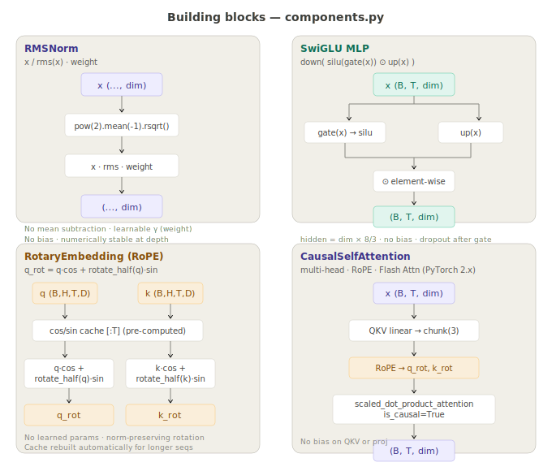
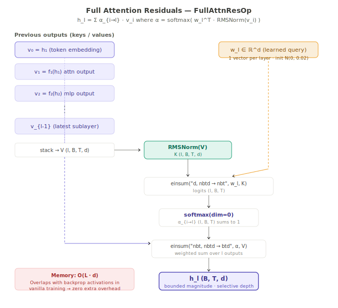
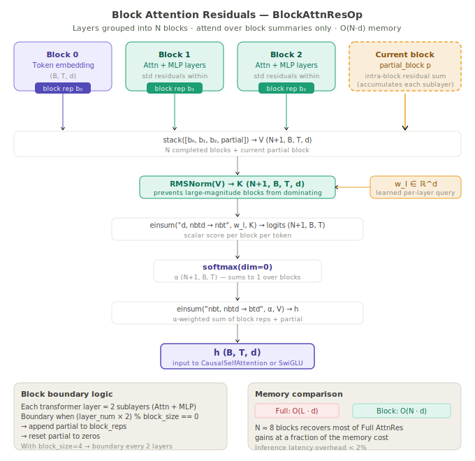
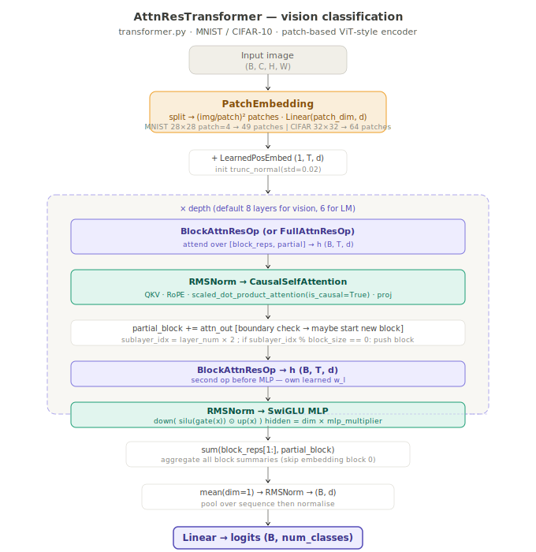
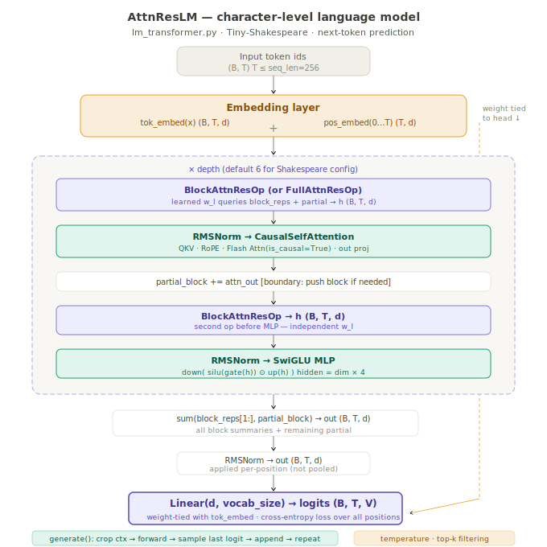

# AttnRes — Attention Residuals in PyTorch

A clean, reproducible PyTorch implementation of
**Attention Residuals (AttnRes)** from MoonshotAI
([paper](https://arxiv.org/abs/2603.15031) · [repo](https://github.com/MoonshotAI/Attention-Residuals)).

AttnRes replaces standard fixed residual connections with learned,
input-dependent softmax attention over preceding layer outputs — giving
every transformer layer selective access to *all* earlier representations,
eliminating the PreNorm dilution problem that compounds with depth.

Three tasks and two datasets are supported out of the box:

| Task | Dataset | Model | Script |
|---|---|---|---|
| Image classification | MNIST, CIFAR-10 | `AttnResTransformer` | `train/train.py` |
| Character-level LM | Tiny-Shakespeare | `AttnResLM` | `train/train_lm.py` |
| Sub-word LM | TinyStories (2.12 M stories) | `AttnResLM` | `train/train_lm.py` |

Every model variant has a matching `Baseline*` counterpart with standard fixed
residuals for controlled A/B comparisons.

---

## Project layout

```
attnres/
├── config/
│   ├── base.yaml                # Image classification — Block AttnRes, MNIST
│   ├── full_attnres.yaml        # Image classification — Full AttnRes, MNIST
│   ├── shakespeare.yaml         # Character-level LM on Tiny-Shakespeare
│   └── tinystories.yaml         # BPE LM on TinyStories (matches 33M paper setup)
├── data/
│   ├── raw/                     # Downloaded / unprocessed data
│   └── processed/               # Cached token tensors + vocab.json (auto-generated)
├── dataset/
│   ├── base_dataset.py          # Abstract base + DataLoader factory
│   ├── image_datasets.py        # MNIST and CIFAR-10 wrappers
│   ├── shakespeare_dataset.py   # HF Hub download + char tokeniser + window sampler
│   ├── tinystories_dataset.py   # HF Hub download + GPT-Neo BPE + window sampler
│   └── tokenizer.py             # Character-level tokeniser (save/load JSON vocab)
├── inference/
│   ├── inference.py             # Image model: load checkpoint → classify
│   └── inference_lm.py          # LM: generate text / evaluate perplexity
├── logs/                        # Timestamped CSV logs (model_name-YYYYMMDDHHMM.csv)
├── models/
│   ├── components.py            # RMSNorm, SwiGLU, RotaryEmbedding, KVCache,
│   │                            #   CausalSelfAttention (+ XSA mode)
│   ├── attn_res.py              # FullAttnResOp, BlockAttnResOp, AttnResTransformerLayer
│   ├── transformer.py           # AttnResTransformer + BaselineTransformer (vision)
│   └── lm_transformer.py        # AttnResLM + BaselineLM (language model)
├── tests/
│   ├── test_components.py       # RMSNorm, SwiGLU, RoPE, KVCache, attention + XSA
│   ├── test_attn_res.py         # FullAttnResOp, BlockAttnResOp, layer tests
│   ├── test_kv_cache.py         # KV-cache correctness across both model families
│   ├── test_shakespeare.py      # CharTokeniser, window dataset, LM model tests
│   ├── test_tinystories.py      # TinyStoriesDataset, BPE pipeline, dispatcher
│   ├── test_tracker.py          # ExperimentTracker (W&B + MLflow, fully mocked)
│   ├── test_transformer.py      # Vision model integration tests
│   └── test_utils.py            # Config, logger, checkpoint, device tests
├── train/
│   ├── train.py                 # Vision model training entry-point
│   └── train_lm.py              # LM training entry-point (Shakespeare + TinyStories)
├── utils/
│   ├── config.py                # Typed dataclasses + YAML loader + CLI overrides
│   ├── logger.py                # CSV logger + rich console + tracker forwarding
│   ├── tracker.py               # ExperimentTracker: W&B / MLflow / null backends
│   ├── checkpoint.py            # best/ and latest/ dual checkpoint manager
│   └── device.py                # Device resolution + seed_everything
├── visualization/
│   ├── plot_logs.py             # Single-run loss / accuracy curves
│   └── compare_models.py        # Multi-model overlay comparison
├── pyproject.toml               # uv / hatchling project definition
└── README.md
```

---

## Quick start

### 1 — Install [uv](https://github.com/astral-sh/uv)

```bash
pip install uv        # or: curl -Ls https://astral.sh/uv/install.sh | sh
```

### 2 — Create the virtual environment and install dependencies

```bash
cd attnres
uv venv
uv pip install -e ".[dev]"
```

### 3 — Run the test suite

```bash
pytest        # 239 tests, all pass
```

---

## Models

All model classes live in `models/`. The architecture is built from composable
layers: shared building blocks → core AttnRes operations → full model assemblies.

### Building blocks — `models/components.py`



| Class | Role |
|---|---|
| `RMSNorm(dim)` | `x / rms(x) · weight` — no mean subtraction, no bias. Cheaper than LayerNorm. |
| `SwiGLU(dim, hidden_dim)` | `down(silu(gate(x)) ⊙ up(x))` — gated FFN. Hidden dim defaults to `dim × 8/3`. No bias. |
| `RotaryEmbedding(head_dim)` | RoPE position encoding. No learned parameters. Supports a position `offset` for KV-cache generation. |
| `KVCache` | Per-layer key/value store for autoregressive inference. `update()` appends; `reset()` / `clear()` wipe between sequences. |
| `CausalSelfAttention(dim, heads, head_dim, use_xsa)` | Multi-head causal attention with RoPE. Optional `kv_cache` argument for cached inference. Optional XSA mode (see below). |

### Full Attention Residuals — `FullAttnResOp`



Replaces `h_l = h_{l-1} + f(h_{l-1})` with softmax attention over **all** previous sublayer outputs:

```
h_l = Σ α_{i→l} · v_i      α = softmax_i( w_l^T · RMSNorm(v_i) )
```

One learned `d`-dimensional vector `w_l` per layer — the only added parameter.
Softmax guarantees bounded output magnitudes at any depth. Memory **O(L·d)**.

### Block Attention Residuals — `BlockAttnResOp`




Production-efficient variant. Layers group into **N ≈ 8 blocks**; standard residuals
accumulate within each block. The AttnRes op attends only over N completed block
summaries plus the current partial sum.

| | Full AttnRes | Block AttnRes |
|---|---|---|
| Attends over | All L sublayer outputs | N block summaries + partial |
| Memory | O(L·d) | O(N·d) |
| Inference overhead | — | < 2% |
| Effective compute gain | — | 0.8× (same quality at 80% budget) |

Selected via `use_block_attn_res` in the config YAML.

### Exclusive Self Attention — XSA (`use_xsa`)

An optional two-line extension to standard attention from
[Zhai (2026), arXiv:2603.09078](https://arxiv.org/abs/2603.09078).
After computing the standard aggregation output `y_i`, the component along the
token's own normalised value vector is removed:

```
z_i = y_i − (y_i · v̂_i) v̂_i      where v̂_i = v_i / ‖v_i‖
```

This eliminates the *attention similarity bias* — SA's tendency to copy its own
value vector into its output — forcing the attention layer to represent only
contextual information orthogonal to the current token's representation.

- Zero new parameters
- Compatible with KV-cache, Block AttnRes, and Full AttnRes
- Negligible computational overhead
- Enabled via `model.use_xsa: true` in config or `--override model.use_xsa=true`

### KV cache — inference acceleration

`CausalSelfAttention` supports an optional per-layer `KVCache` that eliminates
redundant re-computation of past keys and values during autoregressive generation.

**How it works:**
1. **Prefill**: run the full prompt through all layers in one forward pass, populating every layer's cache.
2. **Decode**: at each step, feed only the single new token. Each layer appends its new K/V to the cache and attends over the full accumulated history in O(1) compute per step.

The cache is **inference-only** and must never be active during training.

Enable at the config level (`model.use_kv_cache: true`) or override per call:

```python
model.generate(prompt_ids, max_new_tokens=300, use_kv_cache=True)
```

---

## Image classification



### Train

```bash
# Block AttnRes on MNIST (default):
python train/train.py --config config/base.yaml

# Full AttnRes on MNIST:
python train/train.py --config config/full_attnres.yaml

# Standard-residual baseline:
python train/train.py --config config/base.yaml --baseline

# CIFAR-10:
python train/train.py --config config/base.yaml --override data.dataset=cifar10

# Resume an interrupted run:
python train/train.py --config config/base.yaml --resume

# Enable XSA:
python train/train.py --config config/base.yaml --override model.use_xsa=true
```

### Inference

```bash
# Evaluate on the test set:
python inference/inference.py \
    --checkpoint checkpoints/best/best.pt \
    --eval

# Predict a single image:
python inference/inference.py \
    --checkpoint checkpoints/best/best.pt \
    --input data/sample.png
```

---

## Language models



Both datasets use the same `train/train_lm.py` entry-point, selected by
`data.dataset` in the YAML config (or via `--override`).

### Dataset: Tiny-Shakespeare (character-level)

| Property | Value |
|---|---|
| HF repo | `Trelis/tiny-shakespeare` |
| Corpus size | ~1 M characters |
| Vocabulary | ~67 ASCII characters |
| Tokenisation | Character-level (`CharTokenizer`) |
| Cached to | `data/processed/shakespeare_corpus.txt` · `vocab.json` |

```bash
# Train (Block AttnRes):
python train/train_lm.py --config config/shakespeare.yaml

# Full AttnRes variant:
python train/train_lm.py --config config/shakespeare.yaml \
    --override model.use_block_attn_res=false

# Baseline for comparison:
python train/train_lm.py --config config/shakespeare.yaml --baseline

# Resume:
python train/train_lm.py --config config/shakespeare.yaml --resume
```

### Dataset: TinyStories (BPE sub-word)

A 2.12 M short-story dataset designed for training small language models.
Uses the `EleutherAI/gpt-neo-125M` BPE tokeniser (vocab 50,257) and a
512-token context window, exactly matching the published
[TinyStories-33M](https://huggingface.co/roneneldan/TinyStories-33M) training setup.

| Property | Value |
|---|---|
| HF repo | `roneneldan/TinyStories` |
| Split sizes | 2.12 M train stories · 22 k validation stories |
| Corpus tokens | ~500 M (train) |
| Tokeniser | `EleutherAI/gpt-neo-125M` BPE (vocab 50,257) |
| Context length | 512 tokens |
| Cached to | `data/processed/tinystories_train.pt` · `tinystories_val.pt` |

On the first run, the dataset and tokeniser are downloaded from Hugging Face
and tokenised. The flat token tensor is cached to disk; subsequent runs skip
the encoding step entirely.

```bash
# Full training run (GPU recommended — ~500M tokens × 3 epochs):
python train/train_lm.py --config config/tinystories.yaml

# Fast smoke test — 50 k stories, finishes in minutes on CPU:
python train/train_lm.py --config config/tinystories.yaml \
    --max_train_stories 50000

# With XSA enabled:
python train/train_lm.py --config config/tinystories.yaml \
    --override model.use_xsa=true

# Baseline comparison:
python train/train_lm.py --config config/tinystories.yaml --baseline
```

### Inference and text generation

The inference script auto-detects the dataset type from the checkpoint's saved
config and loads the correct tokeniser automatically.

```bash
# Generate from a TinyStories checkpoint:
python inference/inference_lm.py \
    --checkpoint checkpoints/best/best.pt \
    --prompt "Once upon a time there was"

# Shakespeare checkpoint:
python inference/inference_lm.py \
    --checkpoint checkpoints/best/best.pt \
    --prompt "HAMLET: To be, or not to be"

# Sampling parameters:
python inference/inference_lm.py \
    --checkpoint checkpoints/best/best.pt \
    --prompt "Once upon a time" \
    --max_new_tokens 400 \
    --temperature 0.7 \
    --top_k 50

# Enable KV cache for faster generation:
python inference/inference_lm.py \
    --checkpoint checkpoints/best/best.pt \
    --prompt "Once upon a time" \
    --use_kv_cache

# Evaluate validation-set perplexity:
python inference/inference_lm.py \
    --checkpoint checkpoints/best/best.pt \
    --eval
```

### Sampling parameters

| Parameter | Effect |
|---|---|
| `temperature` | Higher → more random; lower → more deterministic. `1.0` = raw softmax. |
| `top_k` | Restricts sampling to the k most probable next tokens. `0` = disabled. |
| `max_new_tokens` | Number of new tokens to generate beyond the prompt. |

---

## Configuration

All hyper-parameters live in version-controlled YAML files. Every value can be
overridden at the CLI with `--override section.key=value` — no file edits needed
for quick experiments.

### Full `ModelConfig` reference

```yaml
model:
  name: "AttnResLM_TinyStories"
  dim: 512                     # hidden / embedding dimension
  depth: 8                     # number of transformer layers
  heads: 8                     # attention heads
  head_dim: 64                 # dimension per head
  mlp_multiplier: 4            # SwiGLU hidden = dim × mlp_multiplier × 8/3
  dropout: 0.1
  use_block_attn_res: true     # true = Block AttnRes; false = Full AttnRes
  block_size: 4                # sublayers per AttnRes block
  norm_eps: 1.0e-6
  max_seq_len: 512
  use_kv_cache: false          # inference-only; never true during training
  use_xsa: false               # Exclusive Self Attention (arXiv:2603.09078)
```

### Full `LoggingConfig` reference

```yaml
logging:
  log_dir: logs/
  checkpoint_dir: checkpoints/
  tracker: none                # none | wandb | mlflow
  wandb_project: attnres       # W&B project name
  wandb_run_name: ""           # auto-generated if empty
  mlflow_tracking_uri: mlruns  # local path or http://host:port
  mlflow_experiment: AttnRes   # MLflow experiment name
```

### Common CLI overrides

```bash
# Flip the AttnRes variant:
--override model.use_block_attn_res=false

# Enable XSA:
--override model.use_xsa=true

# Enable KV cache at inference:
--override model.use_kv_cache=true

# Change learning rate:
--override training.lr=5e-4

# Switch to CIFAR-10:
--override data.dataset=cifar10

# Enable W&B logging:
--override logging.tracker=wandb logging.wandb_project=my-project

# Enable MLflow logging:
--override logging.tracker=mlflow logging.mlflow_tracking_uri=mlruns
```

---

## Experiment tracking

Training metrics are always written to a timestamped CSV in `logs/`. Optionally,
the same metrics can be forwarded in real time to **Weights & Biases** or
**MLflow** via the `ExperimentTracker` in `utils/tracker.py`.

### Weights & Biases

```bash
pip install wandb
wandb login          # one-time authentication

# Enable in config:
python train/train_lm.py --config config/tinystories.yaml \
    --override logging.tracker=wandb \
               logging.wandb_project=attnres-experiments
```

Each run creates a W&B run. Step-level metrics (`train/loss`, `train/acc`,
`train/lr`) are logged at every `log_every` steps. Epoch-level metrics
(`epoch/train_loss`, `epoch/val_loss`, `epoch/val_acc`, etc.) are logged
after each epoch. The best checkpoint is uploaded as a W&B artifact when
training completes.

### MLflow

```bash
pip install mlflow

# Local file store (no server needed):
python train/train_lm.py --config config/tinystories.yaml \
    --override logging.tracker=mlflow

# View the UI:
mlflow ui      # open http://localhost:5000

# Remote tracking server:
python train/train_lm.py --config config/tinystories.yaml \
    --override logging.tracker=mlflow \
               logging.mlflow_tracking_uri=http://my-server:5000 \
               logging.mlflow_experiment=TinyStories-AttnRes
```

Config hyper-parameters are flattened and logged as MLflow params at run start
(e.g. `model.dim`, `model.use_xsa`). Step and epoch metrics are logged with
the global step as the x-axis. The best checkpoint is uploaded to the artifact
store when training completes.

### Tracker API

The `ExperimentTracker` class can also be used directly:

```python
from utils.tracker import ExperimentTracker
from utils.config import load_config

cfg     = load_config("config/tinystories.yaml")
tracker = ExperimentTracker.from_config(cfg, run_name="my-run")

# Or as a context manager (calls finish() automatically):
with ExperimentTracker.from_config(cfg) as tracker:
    tracker.log_metrics({"train/loss": 0.42}, step=100)
    tracker.log_artifact("checkpoints/best/best.pt")
```

---

## Logging and checkpoints

### CSV logs

Every training run creates one CSV in `logs/`:

```
logs/<model_name>-<YYYYMMDDHHMM>.csv
```

Columns: `epoch, step, phase, train_loss, train_acc, val_loss, val_acc, lr, elapsed_s`

For language-model runs, `train_acc` and `val_acc` store `1 / perplexity`
(monotone proxy). Use the `*_loss` columns to compute perplexity: `ppl = exp(val_loss)`.

### Checkpoints

| Path | Contents |
|---|---|
| `checkpoints/latest/latest.pt` | Saved every epoch (for resuming) |
| `checkpoints/best/best.pt` | Lowest validation loss seen so far |

Each `.pt` file contains `model_state`, `optimizer_state`, `scheduler_state`,
`epoch`, `step`, `val_loss`, `val_acc`, and the full `config` dict for
reproducibility.

---

## Visualisation

```bash
# Plot loss + accuracy curves for a single run:
python visualization/plot_logs.py \
    --log logs/AttnResLM_TinyStories-202406011200.csv

# Compare AttnRes vs baseline side by side:
python visualization/compare_models.py \
    --logs logs/AttnResLM_TinyStories-202406011200.csv \
           logs/BaselineLM-202406011300.csv \
    --out reports/tinystories_comparison.png

# Include training speed (tokens/s):
python visualization/compare_models.py --logs logs/ --speed
```

---

## Test suite

```
tests/
├── test_components.py   — RMSNorm, SwiGLU, RoPE, KVCache, attention shapes,
│                          causal mask, XSA orthogonality, XSA + KV cache
├── test_attn_res.py     — FullAttnResOp, BlockAttnResOp, layer forward/backward
├── test_kv_cache.py     — KVCache lifecycle, cached vs uncached correctness,
│                          AttnResLM and BaselineLM generation, config flag
├── test_shakespeare.py  — CharTokenizer, window dataset, AttnResLM, BaselineLM
├── test_tinystories.py  — TinyStoriesDataset tokenisation + caching, BPE pipeline,
│                          train_lm dataset dispatcher, config wiring
├── test_tracker.py      — ExperimentTracker null / W&B / MLflow (fully mocked),
│                          flatten_dict, TrainingLogger forwarding, config flags
├── test_transformer.py  — PatchEmbedding, AttnResTransformer, BaselineTransformer
└── test_utils.py        — load_config, CLI overrides, TrainingLogger CSV,
                           CheckpointManager, device resolution, seed
```

Run the full suite:

```bash
pytest              # 239 tests
pytest -v           # verbose with test names
pytest -x           # stop on first failure
pytest tests/test_kv_cache.py -v   # single file
```

---

## Feature reference

| Feature | Config key | Default | Notes |
|---|---|---|---|
| Block AttnRes | `model.use_block_attn_res` | `true` | `false` = Full AttnRes |
| Block size | `model.block_size` | `4` | Sublayers per AttnRes block |
| XSA | `model.use_xsa` | `false` | Exclusive Self Attention (arXiv:2603.09078) |
| KV cache | `model.use_kv_cache` | `false` | Inference-only; never enable during training |
| Experiment tracker | `logging.tracker` | `none` | `wandb` or `mlflow` |
| W&B project | `logging.wandb_project` | `attnres` | Used when `tracker: wandb` |
| MLflow URI | `logging.mlflow_tracking_uri` | `mlruns` | Local path or `http://...` |

---

## References

```bibtex
@article{attnres2026,
  title  = {Attention Residuals},
  author = {Chen, Guangyu and Zhang, Yu and Su, Jianlin and others},
  year   = {2026},
  url    = {https://arxiv.org/abs/2603.15031}
}

@article{xsa2026,
  title  = {Exclusive Self Attention},
  author = {Zhai, Shuangfei},
  year   = {2026},
  url    = {https://arxiv.org/abs/2603.09078}
}

@article{tinystories2023,
  title  = {TinyStories: How Small Can Language Models Be and Still Speak Coherent English?},
  author = {Eldan, Ronen and Li, Yuanzhi},
  year   = {2023},
  url    = {https://arxiv.org/abs/2305.07759}
}
```
